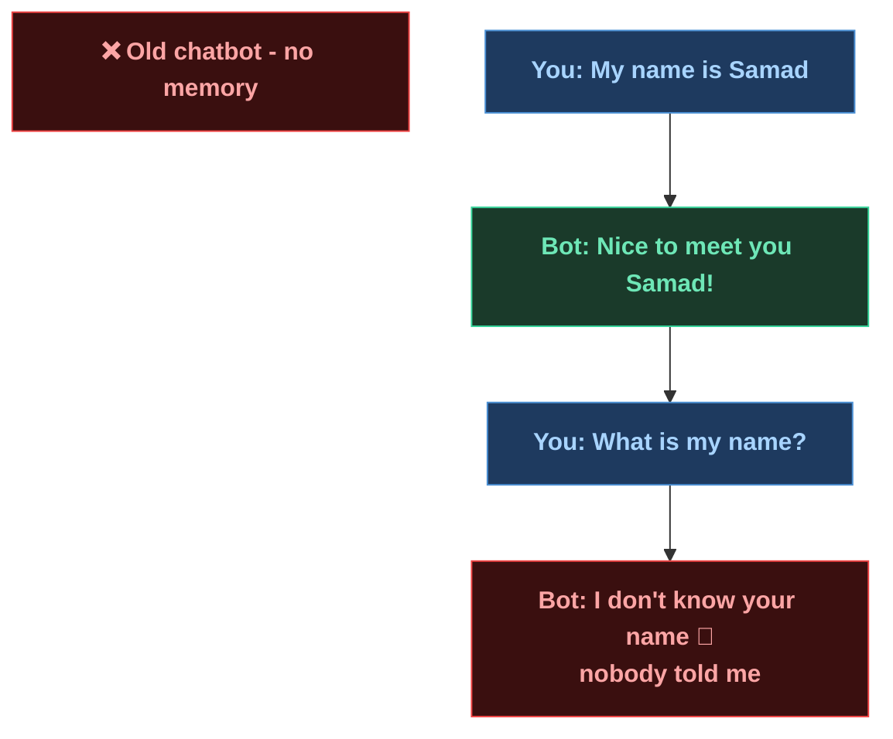
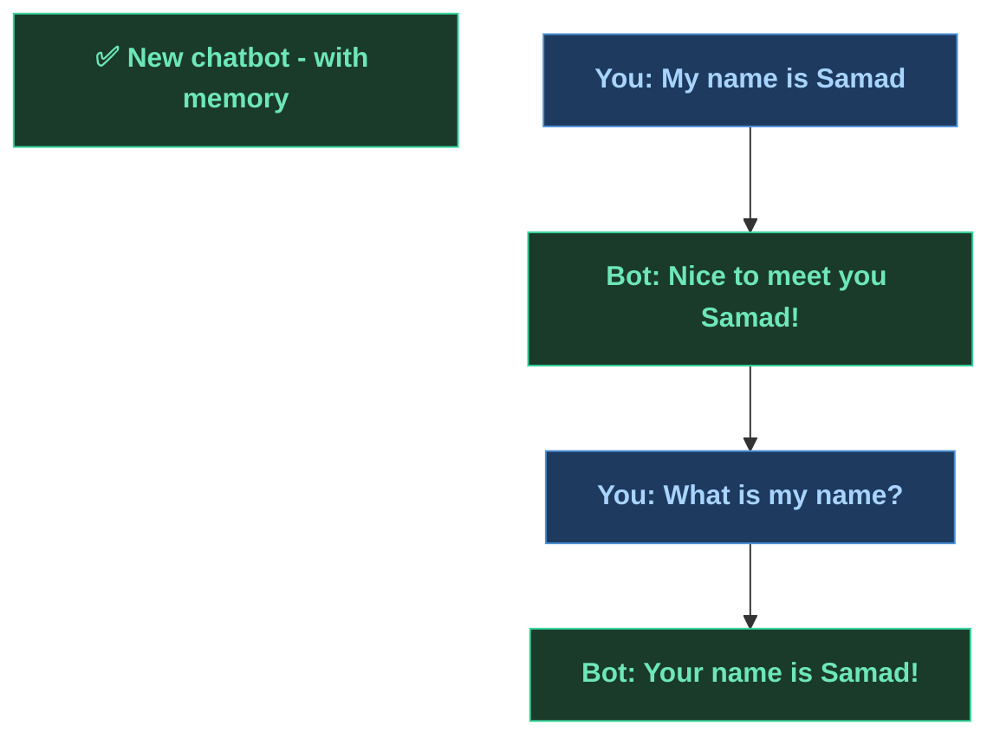
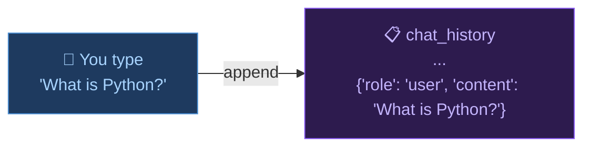
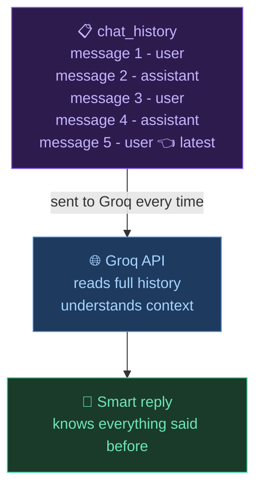
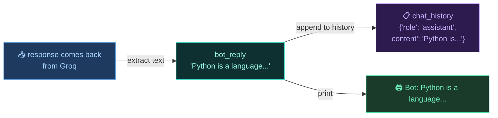
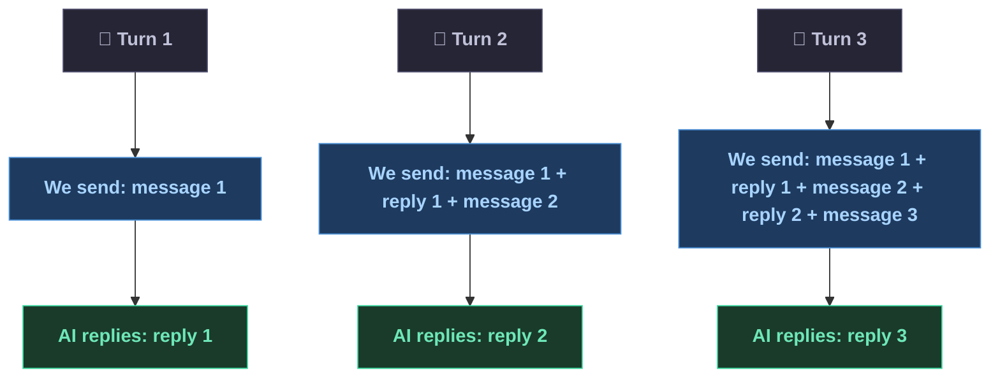
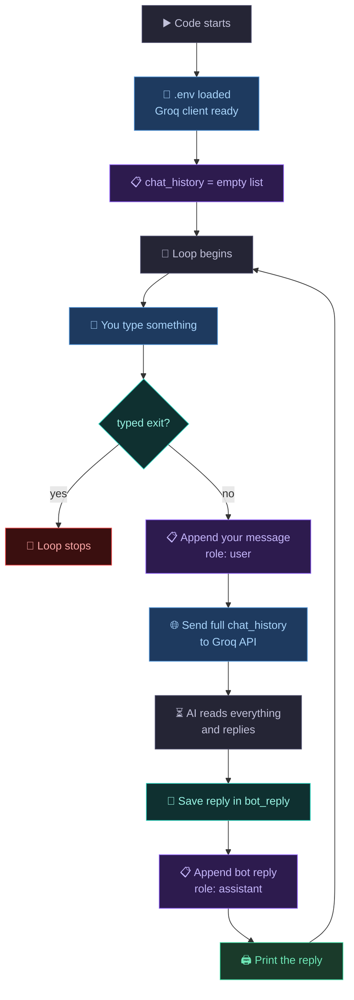
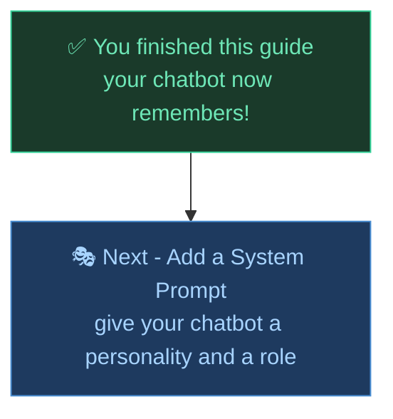

# 🧠 Chatbot with Memory - Now it Remembers You

In the last guide we built a basic chatbot. It worked but had one big problem - it forgot everything after every message. This guide fixes that. We add **memory** so the AI remembers the whole conversation.

The only real change? One list called `chat_history`.

---

## Table of Contents

1. [What is the problem we are fixing?](#what-is-the-problem-we-are-fixing)
2. [What changed from last time?](#what-changed-from-last-time)
3. [The full code](#the-full-code)
4. [Line by line - what each part does](#line-by-line---what-each-part-does)
   - [Part 1 - chat_history list](#part-1---chat_history-list)
   - [Part 2 - Adding your message](#part-2---adding-your-message)
   - [Part 3 - Sending the full history](#part-3---sending-the-full-history)
   - [Part 4 - Saving the bot reply](#part-4---saving-the-bot-reply)
5. [How memory actually works](#how-memory-actually-works)
6. [How it all flows](#how-it-all-flows)
7. [Word List](#word-list)

---

## What is the problem we are fixing?

The old chatbot sent only your current message to the AI every time. So the AI had no idea what happened before.



The new chatbot saves everything and sends the full conversation every time.



---

## What changed from last time?

Only 3 things changed. Everything else is exactly the same.

| What | Old code | New code |
|------|----------|----------|
| Chat history | did not exist | `chat_history = []` created |
| Messages sent to API | only current message | full `chat_history` list |
| Bot reply | printed and forgotten | saved into `chat_history` too |

---

## The full code

```python
from groq import Groq
from dotenv import load_dotenv
import os

load_dotenv()

client = Groq(
    api_key=os.getenv("GROQ_API_KEY")
)

chat_history = []

print("Chatbot Started (type 'exit' to quit)\n")

while True:
    user_input = input("You: ")

    if user_input.lower() == "exit":
        break

    chat_history.append(
        {
            "role": "user",
            "content": user_input
        }
    )

    response = client.chat.completions.create(
        model="llama-3.3-70b-versatile",
        messages=chat_history
    )

    bot_reply = response.choices[0].message.content

    chat_history.append(
        {
            "role": "assistant",
            "content": bot_reply
        }
    )

    print("Bot:", bot_reply)
```

---

## Line by line - what each part does

### Part 1 - chat_history list

```python
chat_history = []
```

This is the only new setup line. It creates an empty list before the loop starts.

This list will grow with every message - yours and the bot's. By the end of a conversation it looks like this:

```python
[
    {"role": "user",      "content": "My name is Samad"},
    {"role": "assistant", "content": "Nice to meet you Samad!"},
    {"role": "user",      "content": "What is my name?"},
    {"role": "assistant", "content": "Your name is Samad!"}
]
```

Each item in the list is a dictionary with two keys - `role` and `content`.

| Key | What it means |
|-----|--------------|
| `role` | who said this - either `"user"` or `"assistant"` |
| `content` | what was actually said |

The AI reads this list and knows exactly who said what and in what order.

---

### Part 2 - Adding your message

```python
chat_history.append(
    {
        "role": "user",
        "content": user_input
    }
)
```

Before sending anything to the AI, we first save your message into `chat_history`.

`.append()` adds a new item to the end of the list. So every time you type something, it gets added as a new dictionary with `role: user`.



---

### Part 3 - Sending the full history

```python
response = client.chat.completions.create(
    model="llama-3.3-70b-versatile",
    messages=chat_history
)
```

Notice what changed here from the old code.

Old code sent only the current message:
```python
messages=[{"role": "user", "content": user_input}]
```

New code sends the whole history:
```python
messages=chat_history
```

This is how the AI remembers. We are not storing memory inside the AI - we are just sending it the full conversation every single time. The AI reads it all fresh and replies knowing everything that was said before.



---

### Part 4 - Saving the bot reply

```python
bot_reply = response.choices[0].message.content

chat_history.append(
    {
        "role": "assistant",
        "content": bot_reply
    }
)

print("Bot:", bot_reply)
```

After we get the reply we do two things.

First we save it in `bot_reply` so we can use it twice without writing `response.choices[0].message.content` two times.

Then we append it to `chat_history` with `role: assistant`. This is important - if we skip this step, the AI will not remember its own previous answers either.



---

## How memory actually works

Here is the important thing to understand. **The AI has no memory of its own.**

Every time you send a message, the AI starts completely fresh. It does not store your conversation anywhere. We are the ones keeping the list and re-sending everything each time.



Every turn we send a little more. The list keeps growing. That is why a very long conversation costs more - more tokens are being sent each time.

---

## How it all flows



---

## Word List

| Word | Simple meaning |
|------|--------------|
| `chat_history` | a list that stores all messages in order |
| `.append()` | adds a new item to the end of a list |
| `role` | who said a message - either user or assistant |
| `content` | the actual text of the message |
| `bot_reply` | a variable to hold the AI's reply text |
| Context | everything the AI can read in one go |
| Token | a small piece of text - sending more history means more tokens |

---

## What's Next?



---

*Made by Abdul Samad*
